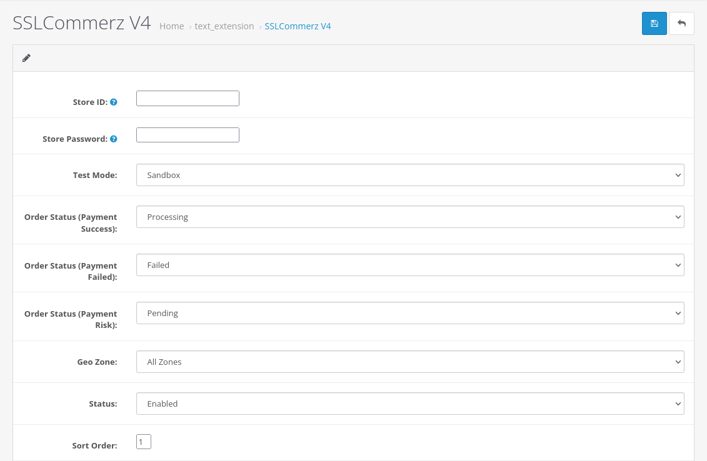

# SSLCommerz - Opencart

SSLCOMMERZ-Online Payment Gateway For Bangladesh

This Module Work for Opencart Version 3.x.x

### Prerequisite

  - A functioning opencart website
  - A [Sandbox Account](https://developer.sslcommerz.com/registration/ "SSLCommerz Sandbox Registration") or [Live Merchant Account](https://signup.sslcommerz.com/register/ "Merchant Registration")

### Installation Steps:

Please follow these steps to install the SSLCommerz Payment Gateway extension -

- Step 1: Download or clone the project files 

- Step 3: Unzip and upload `catalog` and `admin` with all contents inside to the root of your opencart website.
  
- Step 4: Login to the Open Cart admin section and go to Extensions > Extensions > Payments

- Step 5: Find SSLCommerz extention in the list

- Step 6: Click `Install` and then `Edit` the payment module settings

- Step 7: Add store id, store password and choose Test Mode mode Sandbox.
 
- Step 8: Do UAT by doing some test transactions

- Step 9: If UAT is successful, you can use live store id and password (same process as step 7) and choose Test Mode mode Live.

Notes :
* Initially order status will be `Pending`

* Order Status (Payment Success): Should be `Processing`.

* Order Status (Payment Failed): Should be `Failed`.

* Order Status (Payment Risk): Should be `Canceled`.

* Geo Zone: All Zones

--------------------------------------------

- Author : Prabal Mallick
- Team Email: integration@sslcommerz.com (For any query)
- More info: https://www.sslcommerz.com

© 2019-2023 SSLCOMMERZ ALL RIGHTS RESERVED
